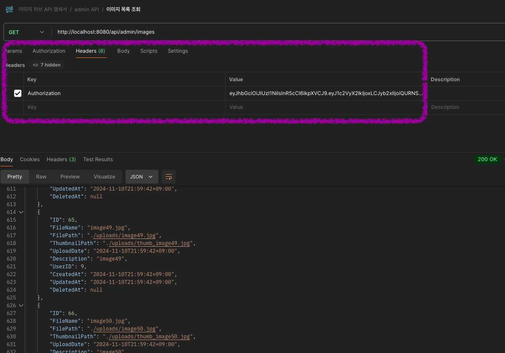

# image-hub-platform
이미지 업로드 및 관리 플랫폼 개발


- **프로젝트 요구사항 및 구현 API**는 [여기](./docs/Requirement.md)에서 확인할 수 있습니다.
- 프로젝트 기여룰은 [여기](./CODE_OF_CONDUCT.md)에서 확인할 수 있습니다.

## 패키지 구조 설명
- 최상단 의존성 주입 담당과 프로젝트 실행하는 `cmd/main.go`
- `initalizer` 패키지는 main.go에서 의존성 주입을 간단하게 해주는 초기화 패키지입니다.
- `middleware` 패키지는 JWT 토큰 검증과 권한 검증을 담당합니다.
- `controller` 패키지는 API 요청을 받아 서비스에 전달하고, 서비스의 결과를 클라이언트에 전달을 담당합니다.
- `service` 패키지는 비즈니스 로직을 담당합니다.
- `repository` 패키지는 데이터베이스와의 상호작용을 담당합니다.
- `model` 패키지는 데이터베이스 테이블과 매핑되는 구조체를 담당합니다.
- `test` 패키지는 테스트 코드를 담당합니다.
- `scripts` 디렉토리는 데이터베이스 스키마와 더미 데이터를 담당합니다.
- `uploads` 디렉토리는 이미지 파일과 썸네일 파일을 저장합니다.

## 프로젝트 실행 방법
1. 프로젝트를 클론과 의존성 설치
    ```bash
    git clone https://github.com/zeze1004/image-hub-platform.git
   
    cd image-hub-platform
    
    go mod tidy
    ```

2. `.env` 파일 생성
    ```bash
    echo -e "DB_USER=root\nDB_PASS=\nDB_HOST=127.0.0.1\nDB_NAME=image_hub\nJWT_SECRET=image_hum_secret_key" >> .env
    ```
3. 더미 데이터 스크립트 생성
    ```bash
    mysql -u root -p < scripts/database.sql
    ```

3. 프로젝트 빌드
    ```bash 
    go build -o image-hub-platform github.com/zeze1004/image-hub-platform/cmd
    ```
   
4. 테스트 실행
    ```bash
   go test ./test
    ```

5. 프로젝트 실행
    ```bash
    ./image-hub-platform
    ```
6. API 문서 확인
   - [API 문서](https://web.postman.co/workspace/b9e53c18-96ff-4761-9e82-6114ad572b61/request/13487201-77046d0f-fc23-4f1c-b7ee-66153169ed3c) 로 접속해주세요.

## API 호출법
API 호출에 앞서 더미 데이터에 대해 설명해드릴게요. 
아래 더미 데이터를 이용해서 API를 호출해주세요.

1. 더미 데이터는 다음과 같이 구성되어 있습니다.
   - USER 계정 5개(`user1@example.com ~ user5@example.com`)
   - ADMIN 계정 1개(`admin@example.com`)
   - 이미지 테이블에 메타데이터 5개
     - `./uploads/{userID}` 폴더에 메타데이터와 맵핑된 더미 이미지 파일과 썸네일 파일이 있습니다.
   - image_category 테이블에 이미지가 갖는 카테고리들이 있습니다.

2. 계정 토큰 얻는 법은 포스트맨의 로그인 API 호출해서 토큰을 얻어주세요

   - 회원가입은 USER 권한 계정만 생성됩니다.
   - ADMIN 권한 계정은 직접 데이터베이스에 추가해주세요.


   - 로그인 호출 후 얻은 토큰을 Header에 넣어주세요.
   - 위 스크린샷 예제는 `이미지 목록 조회 admin API`로 더미데이터에 넣은 이미지들이 조회됩니다.

3. 이미지 생성 API 후 이미지 파일 확인
이미지 API가 성공적으로 호출되면 `./uploads/{userID}` 폴더에 이미지 파일이 저장됩니다.
   - 이미지 파일은 `./uploads/{userID}/{imageID}` 폴더에 저장됩니다.
   - 썸네일 파일은 `./uploads/{userID}/{imageID}/thumbnail` 폴더에 저장됩니다.
     - 썸네일 파일은 원본 이미지 파일을 리사이즈돼서 저장됩니다.
   - 파일 경로와 파일 이름 등의 메타데이터는 `image` 테이블에 저장됩니다.
   - 썸네일 조회는 USER 권한 계정만 가능합니다.

4. 이미지 조회 API 호출 방안

   - 위 스크린샷은 어드민 API에서 특정 userID의 이미지 목록을 조회한 결과입니다.
   - 엔드포인트의 params는 간단하게 테스트하기 위해 일괄적으로 모두 Path Parameter로 받습니다.
   - Path Parameter는 경로에 `/:{...}` 형태를 Key로 같습니다.
     - 위 예제에서 `/:userID`는 7로 대체 되어 API가 호출됩니다. 

## 아키텍처 설계시 고민했던 지점

**1) 미들웨어를 사용해 관심사 분리**

   이 프로젝트에서 USER와 ADMIN 권한을 구분하는 케이스가 많습니다.
   처음에는 controller에서 권한을 체크하고, 권한에 따라서 서비스를 호출하도록 설계했습니다.
   그러나 권한 검증은 controller의 역할에서 벗어났다고 생각했고,
   관심사 분리를 위해 middleware로 분리했습니다.

   - middleware 는 권한별 검증 외에도 JWT 토큰 검증을 담당합니다.

**2) 서버의 이미지 파일 삭제를 비동기 처리로 하여 성능 향상**

   이미지 파일 삭제 API를 구현할 때, 이미지 파일 삭제와 썸네일 파일 삭제를 구현했습니다.
   이미지 파일 삭제는 서버에 저장된 이미지 파일을 삭제하는 작업입니다.

   이미지가 몇 개 없을 때는 큰 문제가 없지만, 이미지 파일이 많아지고 다수의 이미지를 삭제하면 서버의 성능이 저하될 수 있다고 생각했습니다.
   이를 해결하기 위해 이미지 파일 삭제 API 호출 시, 비동기로 이미지 파일 삭제 작업을 수행하도록 구현했습니다.
   
   제 추론이 맞는지 테스트를 통해 확인했습니다.

   [PR-28](https://github.com/zeze1004/image-hub-platform/pull/28) 에 제가 구현한 비동기 파일 삭제 로직과
   순차적으로 파일을 삭제하는 구현체의 성능을 비교한 테스트 코드([커밋](https://github.com/zeze1004/image-hub-platform/pull/28/commits/b05dccbba748778cd2c1c8a475badaa2c7d1f927))가 있습니다.
   
   직접 테스트 파일을 생성하고 go benchmark를 통해 1000개의 파일을 삭제하는 시간을 측정했습니다.
   파일 수가 100개 단위면 큰 차이가 없지만, 1000개부터는 비동기 파일 삭제가 월등이 빠르다는 걸 증명할 수 있었습니다.
   
## 왜 GO인가요. (프로젝트 후기)
찍어내듯이 개발을 한다면 Spring이 더 빨랐을 겁니다.

Spring의 강력한 에코시스템은 파일 업로드, 다운로드, 이미지 리사이징, 비동기 처리, DI 컨테이너를 통한 의존성 주입 등을 간단하게 제공해주지만,

이런 기능들을 직접 구현하면서 단순 구현에 그치지 않고 내부 로직에 대한 이해도가 훨씬 높아질 수 있었습니다.

그럼에도 다음에 비슷한 프로젝트를 한다면 Spring을 다시 고려할거 같아요.
Mocking에 시간이 많이 걸려서 Spring의 JUnit이 그리워졌습니다.

어느 언어로 개발을 하든, 다양한 언어를 경험해보면서 각 언어와 프레임워크의 장단점을 알 수 있고,
이번 프로젝트를 통해 Go의 장점과 단점, 그리고 다른 언어와의 비교를 할 수 있는 기회가 됐습니다.

지금은 GO를 사용했지만, 어떤 언어든 그 언어의 장점을 살려서 프로젝트를 진행할 수 있는 자신감을 얻었습니다.